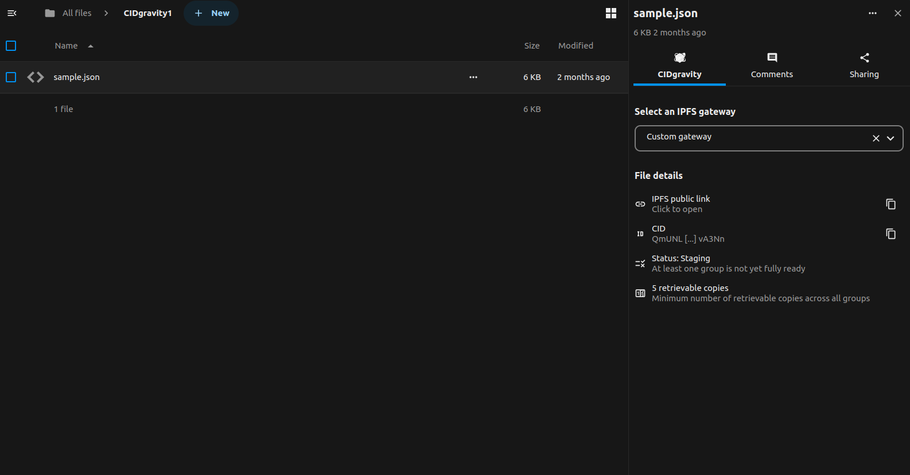

# CIDgravity for Nextcloud

**Decentralized Storage Integration via IPFS & Filecoin**
CIDgravity integrates IPFS and Filecoin as a decentralized backend for your Nextcloud instance. It enables seamless storage and retrieval of files using content addressing (via IPFS CIDs), while leveraging Filecoin for persistent and verifiable storage.

With CIDgravity, users can continue working within the familiar Nextcloud interface, while benefiting from the resilience, **verifiability**, and **immutability** provided by Web3 storage protocols like IPFS.



## Requirements
* Nextcloud 31

## Key Features
- Add IPFS + Filecoin as an External Storage backend in Nextcloud
- Store files in IPFS and back them with Filecoin storage deals
- Retrieve files via their IPFS CIDs from **any public IPFS gateway**
- Share data easily with simple IPFS links
- View IPFS/Filecoin info directly in the **Nextcloud file details panel**
- Maintain Nextcloud file versioning and metadata sync
- Transparent integration with minimal disruption to end-user experience
- Decentralized by design: Your data is safely replicated across the IPFS/Filecoin network — even if CIDgravity disappears, content remains accessible via its CID.

📘 **Learn More:** [What is IPFS?](https://docs.ipfs.tech/concepts/what-is-ipfs/)

## Get Started

- 🧾 **Access:** Create an account <a href="https://nextcloud.twinquasar.io" target="_blank">HERE</a>
- 🎁 **Storage:** First 25 GB are free; then $5 per TB per month
- 🔐 **Important:** Data stored on IPFS/Filecoin is **public**. Please encrypt sensitive content or only upload non-private files.

## Installation
### Automatic installation (*recommended*)
Certainly! Here's a clearer and more helpful version of that section, including instructions for installing an app from the Nextcloud App Store (for when it's available):

---

## Installation
### Automatic Installation (*Recommended*)
You can install the app directly from the Nextcloud App Store:

1. Log in to your **Nextcloud** instance as an **administrator**.
2. Click your profile icon in the top-right corner and select **Apps**.
3. In the **App Store**, use the search bar to find **CIDgravity - IPFS/Filecoin external storage**.
4. Click **Download and enable** to install the app.

The app will now be available in your Nextcloud instance and ready for configuration.

### Manual installation (from releases)
* Download the latest version from the [release page](https://github.com/CIDgravity/nextcloud-cidgravity-app/releases/latest).
* Extract the archive to your Nextcloud's app folder, e.g. `unzip cidgravity-vx.x.x.zip -C /path/to/nextcloud/apps`
* Enable the app in the Apps section of your Nextcloud.

### Manual installation (from repository)
* Simply clone the repo to your apps folder and build the frontend:

```
cd /path/to/nextcloud/apps/
git clone https://github.com/CIDgravity/nextcloud-cidgravity-app.git
mv nextcloud-cidgravity-gateway-app/ cidgravity/
cd cidgravity/
make composer
make npm-init
make build-js-production
```

* Enable the app in the Apps section of your Nextcloud.

Here’s an improved and more professional version of that README section:

---

### Required Configuration

To enable advanced features of the **CIDgravity Gateway**, you need to update your Nextcloud configuration file. 
Add the following line to your `config.php`:

```php
'cidgravity_gateway_external_storage_enabled' => true,
```

This setting enables support for external storage through the CIDgravity Gateway.